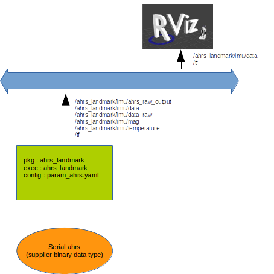

# **ahrs_landmark**
--------


## 1 - Overview
--------
ROS Package for a LANDMARK AHRS system (Attitude and Heading Reference System) designed and provided by [Gladiator Technologies](http://www.gladiatortechnologies.com/).<br>

Date : 25/09/2017<br>

Authors :<br>
* Auteur 1 : Laurent Malaterre (2017) laurent.malaterre@uca.fr (parsing methods, ROS migration developper)
* Auteur 2 : Stephane Witzmann (2014) stephane.witzmann@univ-bpclermont.fr (serial connection utilities & driver, process connections)

Company : [Institut Pascal](http://ip.univ-bpclermont.fr/index.php/fr/) & [IMOBS3](http://www.imobs3.univ-bpclermont.fr/index.php/en/) <br>

This package is supported by the Labex IMOBS3 of Clermont-Ferrand (France) and the ROS-Clermont research group. 

## 2 - Description
-----------
Ce package comprend la connection à un capteur AHRS par liaison serie, le parsage des trames et la fourniture de topics **ros-academic** (sensor_msgs/Imu, sensor_msgs/MagneticField) et **full-sensor** sur-mesure labo (AhrsLmrk).
Il génère une fenêtre RViz préconfigurée pour le test.




### Definition :
-----------
  * AHRS : Attitude and Heading Reference System. C'est une centrale inertielle améliorée, capable de fournir entre autres une attitude. L'attitude autour du Z donne le cap magnétique.
  * [AHRS_Wikipedia](https://fr.wikipedia.org/wiki/Attitude_and_Heading_Reference_System)

### Documents fabricant :
-----------
  * DataSheet - *./doc/LandMark40_AHRS_datasheet_130215.pdf*
  * User's guide - *./doc/LandMark10_20_40_AHRS_USERGUIDE_USB_Rev_2012-11-20.pdf*

### Topics generés: 
-----------
## Liste (type : nom):

```text
ahrs_landmark/AhrsLmrk    : /ahrs_landmark/imu/ahrs_raw_output
sensor_msgs/Imu           : /ahrs_landmark/imu/data
sensor_msgs/Imu           : /ahrs_landmark/imu/data_raw
sensor_msgs/MagneticField : /ahrs_landmark/imu/mag
std_msgs/Float64          : /ahrs_landmark/imu/temperature
tf                        : /tf
```

## type AhrsLmrk (topic /imu/ahrs_raw_output)
-----------

``` text
Header header

float64 G_x
float64 G_y
float64 G_z
float64 A_x
float64 A_y
float64 A_z
float64 Temp
float64 Mgn_x
float64 Mgn_y
float64 Mgn_z
float64 Pressure
float64 AttRot_x
float64 AttRot_y
float64 AttRot_z
float64 Vx         // not effective
float64 Vy         // not effective
float64 Vz         // not effective
float64 BaroAlt
float64 Temperature
float64 AirSpeed   // pito sensor never connected
```

## 3 - Utilisation
-----

### a - ahrs_landmark:

Pour lancer le node :
```
roslaunch ahrs_landmark landmark_driver.launch
```

Il prend en parametre les caractéristiques contenues dans **config/param_ahrs.yaml** :
<br>

```yaml
serial_dev: '/dev/ttyUSB0'
frame_id: 'ahrs_link'
parent_frame_id: 'base_link'
linear_acceleration_stddev: 0.
angular_velocity_stddev: 0.
magnetic_field_stddev: 0.
orientation_stddev: 0.
local_gravity: 9.81
``` 

## 4 - Divers
-----

### a - dependances:
Le paquet ahrs_landmark est dépendant de vbus_sockets.

-----
### b - done:
* 25/9/2017 ce paquet est testé en statique avec les SN 154 et 153<br>
-> Todo : Supply a pose message with a PoseStamped and Quaternion (nav_msgs/Odometry). Create a RVIZ simple configuration file.
Sources : 
  - https://en.wikipedia.org/wiki/Conversion_between_quaternions_and_Euler_angles
  - https://answers.ros.org/question/66510/drawing-poses-in-a-coordinate-system-in-rviz/

* 16/11/2017 Enhencements avec la production de topics "académiques" et l'émission de tf.

-----
### c - materiel testé:
* LMRK40AHRS 300-10-100 - Serial number 153 et 154.

-----


